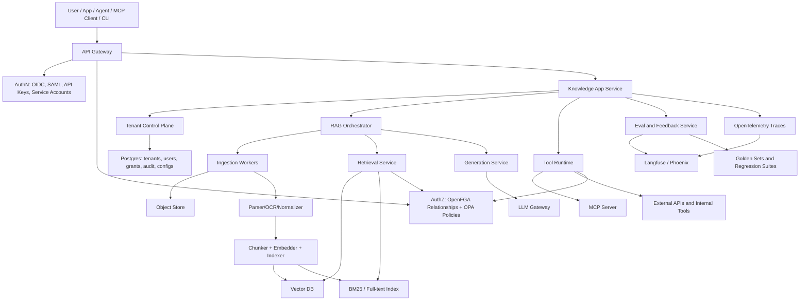
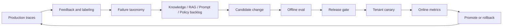

# Enterprise Knowledge Base Design

Status: draft
Date: 2026-06-27

## Purpose

This document designs an enterprise knowledge-base platform that combines:

- multi-tenant isolation
- RAG over enterprise documents and structured knowledge
- strict permission control
- API, CLI, SDK, and MCP access
- offline and online metrics that form a closed improvement loop

The goal is not just to pick a single open-source product. The goal is to
extract the strongest mechanisms from current RAG platforms and design a
coherent product architecture that can be implemented, operated, evaluated, and
improved continuously.

## Executive Recommendation

Build the system as a governed knowledge platform, not as a chat UI around a
vector database.

Recommended base strategy:

1. Use an existing enterprise platform only if it satisfies licensing,
   multi-tenant, and governance constraints.
2. Treat Dify Enterprise, MaxKB X-Pack, RAGFlow, WeKnora, Open WebUI, Flowise,
   and AnythingLLM as reference implementations for different subsystems.
3. Use a dedicated authorization layer, observability layer, and evaluation
   layer even when the UI/product shell is adopted from another project.

If speed matters most:

- Primary product shell: Dify Enterprise or MaxKB X-Pack.
- Retrieval/document subsystem: RAGFlow patterns, or RAGFlow as an external
  retrieval service when document parsing quality dominates.
- Observability and evaluation: Langfuse plus Ragas or DeepEval.
- Authorization model: OpenFGA-style relationship authorization plus OPA-style
  policy checks for contextual rules.

If building a defensible enterprise platform from scratch:

- API and tenant control plane: first-party service.
- Vector/search layer: Qdrant, Milvus, Weaviate, Elasticsearch/OpenSearch, or
  pgvector depending on scale and operational constraints.
- RAG orchestration: custom pipeline using LlamaIndex, Haystack, or LangChain
  only at the integration boundary.
- Observability: OpenTelemetry-compatible traces, Langfuse-compatible export.
- Evaluation: internal eval runner with Ragas/DeepEval-compatible metrics.
- MCP: first-party MCP server that exposes permission-scoped knowledge tools.

## Sources Reviewed

The comparison used current GitHub metadata and official docs as of
2026-06-27.

| Area | Source |
| --- | --- |
| Dify | https://github.com/langgenius/dify, https://docs.dify.ai/en/use-dify/workspace/readme, https://docs.dify.ai/en/use-dify/monitor/integrations/integrate-langfuse |
| MaxKB | https://github.com/1Panel-dev/MaxKB, https://maxkb.cn/docs/v2/user_manual/dataset/dataset/, https://github.com/1Panel-dev/MaxKB/releases/tag/v2.0.0 |
| RAGFlow | https://github.com/infiniflow/ragflow, https://ragflow.io/docs/configure_knowledge_base, https://ragflow.io/docs/run_retrieval_test, https://ragflow.io/docs/tracing |
| WeKnora | https://github.com/Tencent/WeKnora |
| AnythingLLM | https://github.com/Mintplex-Labs/anything-llm, https://docs.useanything.com/features/security-and-access |
| Open WebUI | https://github.com/open-webui/open-webui, https://docs.openwebui.com/features/authentication-access/rbac/ |
| Flowise | https://github.com/FlowiseAI/Flowise, https://docs.flowiseai.com/using-flowise/workspaces |
| LlamaIndex | https://github.com/run-llama/llama_index |
| LangChain | https://github.com/langchain-ai/langchain |
| Haystack | https://github.com/deepset-ai/haystack |
| GraphRAG | https://github.com/microsoft/graphrag |
| Langfuse | https://github.com/langfuse/langfuse, https://langfuse.com/docs |
| Phoenix | https://github.com/Arize-ai/phoenix |
| Ragas | https://github.com/explodinggradients/ragas, https://docs.ragas.io/en/stable/concepts/metrics/available_metrics/ |
| DeepEval | https://github.com/confident-ai/deepeval, https://deepeval.com/docs/getting-started-rag |
| Authorization | https://github.com/openfga/openfga, https://github.com/open-policy-agent/opa, https://github.com/apache/casbin |
| MCP | https://github.com/modelcontextprotocol/modelcontextprotocol |
| Vector/search | https://github.com/qdrant/qdrant, https://github.com/milvus-io/milvus, https://github.com/weaviate/weaviate, https://github.com/pgvector/pgvector |

## Product Requirements

### Functional Requirements

The platform must support:

1. Multiple tenants in the same deployment.
2. Multiple workspaces or departments inside one tenant.
3. Tenant-scoped users, groups, roles, service accounts, API keys, and billing
   or quota boundaries.
4. Knowledge bases with files, websites, wikis, SaaS connectors, database
   snapshots, and manually curated entries.
5. RAG answers with citations and source previews.
6. Strict authorization at tenant, workspace, knowledge base, document, chunk,
   conversation, tool, and API key levels.
7. Cross-workspace and cross-tenant sharing only through explicit grants.
8. Retrieval test, offline evaluation, production tracing, user feedback, and
   regression gates.
9. External use through Web UI, REST API, streaming API, CLI, SDK, web widget,
   and MCP server.
10. Audit logs for administrative, data, retrieval, generation, and tool-use
    events.

### Non-Functional Requirements

The platform must provide:

- zero known cross-tenant data leakage
- explainable retrieval with chunk IDs, document IDs, scores, and citation spans
- reproducible answer generation through prompt, model, retriever, index, and
  policy versioning
- rollback for bad prompt, model, parser, chunking, indexing, and permission
  changes
- per-tenant quotas, rate limits, cost ledgers, retention policies, and model
  provider configuration
- support for private cloud and on-prem deployments
- observability that separates retrieval failures from generation failures
- evaluation gates that treat missing dimensions as zero, not as "not
  applicable"

## Repository And Product Comparison

### Application Platforms

| Project | Strengths | Gaps for this design | Borrow |
| --- | --- | --- | --- |
| Dify | Mature AI app/workflow platform, workspace model, knowledge bases, monitoring integrations with Langfuse/LangSmith/Phoenix, logs and annotations, knowledge retrieval node | Multi-workspace/multi-tenant self-hosting is enterprise/commercial; license restricts unauthorized multi-tenant service operation | App builder, workflow UX, tracing integrations, annotation workflow |
| MaxKB | Enterprise knowledge-base orientation, workspace/resource authorization, shared resources, foldered KBs, model/tool/app resource model | Advanced eval and observability loop is less complete than Dify/Langfuse stack; X-Pack for key enterprise features | Workspace resource model, shared-resource grants, enterprise KB UX |
| RAGFlow | Strong document parsing, dataset configuration, retrieval tests, hybrid search tuning, optional knowledge graph, Langfuse tracing | Better as RAG engine than full enterprise tenant governance layer; cross-tenant knowledge federation is not a mature first-class surface | Parsing/indexing/retrieval test patterns, document debugging UX |
| WeKnora | Direct fit for enterprise KB, RAG, agent, MCP, CLI, tenant RBAC, per-tenant audit, Langfuse observability in one narrative | License and maturity need legal/technical diligence before adoption | Integrated MCP/CLI/product architecture, tenant audit, self-maintaining wiki idea |
| AnythingLLM | Easy local-first deployment, multi-user mode, workspace document scope, agents, MIT license | Multi-user is Docker-only; tenant model is simpler than enterprise org/workspace governance | Simple onboarding, workspace-scoped chat/docs, local deployment simplicity |
| Open WebUI | Strong RBAC documentation, groups, resource grants for models/knowledge/tools, permission preview | Primarily LLM UI; not a full enterprise KB/RAG lifecycle platform by itself | Group/resource ACL model and access-preview UX |
| Flowise | Visual agent/workflow builder, enterprise workspaces/RBAC, API/CLI/SDK, tracing/evals/HITL/MCP capabilities | Workspace/RBAC is Cloud/Enterprise; more workflow builder than governed KB platform | Visual pipeline builder, API/CLI/SDK/MCP integration surface |

### Frameworks And Infrastructure

| Component | Recommended role |
| --- | --- |
| LlamaIndex | Useful for ingestion, document abstraction, retrievers, and agent/data connectors. Avoid making it the authority for tenants or permissions. |
| Haystack | Useful when explicit, testable RAG pipelines matter more than rapid app-building. Good inspiration for modular retrieval/generation components. |
| LangChain/LangGraph | Useful for tool calling and agent workflows. Keep business-critical permissions outside framework memory/state. |
| GraphRAG | Optional subsystem for entity/community-level retrieval when documents are long, relational, or exploratory. Not a substitute for basic hybrid retrieval. |
| Langfuse | Strong default for traces, sessions, prompt versions, datasets, experiments, user feedback, and eval scores. |
| Phoenix | Strong open-source alternative for observability and eval workflows. |
| Ragas | Good RAG metrics vocabulary: context precision, context recall, response relevancy, faithfulness, factual correctness. |
| DeepEval | Good CI-friendly evaluation framework, span-level retriever/generator evaluation, strict thresholds, multi-turn metrics. |
| OpenFGA | Best fit for relationship-based authorization across tenants, workspaces, groups, KBs, documents, tools, and service accounts. |
| OPA | Best fit for contextual policy decisions: data residency, time windows, DLP, model restrictions, tool approval, admin break-glass. |
| Casbin | Good embedded RBAC/ABAC option for simpler deployments, but less natural for relationship-heavy enterprise resource sharing. |
| Qdrant/Milvus/Weaviate | Dedicated vector database options. Prefer when scale, filtering, or vector operations exceed pgvector comfort. |
| pgvector | Good early-stage or simpler enterprise deployment when strong Postgres operational discipline is already available. |
| Elasticsearch/OpenSearch | Strong keyword/BM25 and hybrid retrieval partner. Use alongside vector search or use native vector features if operationally preferred. |

## Architectural Principles

1. Tenant isolation is enforced at every layer, not just the UI.
2. Authorization filters run before retrieval ranking and again before answer
   assembly.
3. All answer claims must be traceable to retrieved, permitted sources or be
   explicitly marked as model reasoning.
4. Every production answer produces a trace that can become an evaluation case.
5. Retrieval, generation, tool use, and permissions are independently
   measurable.
6. Tool access uses scoped service accounts and policy checks; MCP does not
   bypass normal authorization.
7. Shared knowledge is modeled as explicit grants, not as hidden global access.
8. Tenant-level customization is versioned: model, prompt, retriever, parser,
   chunker, policy, and connector versions all matter.

## System Architecture



## Core Services

### 1. Tenant Control Plane

Responsibilities:

- create and manage tenants, workspaces, users, groups, roles, service accounts,
  and API keys
- store model provider configuration and BYOK credentials
- manage quotas, retention, data residency, and billing metadata
- expose permission preview and audit search
- version tenant configuration

Key invariants:

- every resource has `tenant_id`
- every workspace resource has `workspace_id`
- every cross-workspace or cross-tenant access path has a grant
- system admins do not automatically bypass tenant data policies in normal
  request paths

### 2. Knowledge Service

Responsibilities:

- manage knowledge bases, folders, documents, versions, tags, metadata, and
  source connectors
- create immutable index versions
- expose document lineage from source to parsed text to chunks to answers
- support shared KBs through explicit grant records

### 3. Ingestion And Indexing Service

Responsibilities:

- connector sync: file upload, web crawl, Notion, Confluence, Feishu/Lark,
  Google Drive, SharePoint, Git, database exports, and custom API sources
- malware scanning and DLP checks before parsing
- parsing/OCR/layout extraction
- chunking and metadata extraction
- embedding, keyword index, optional graph construction
- async job orchestration with retries and dead-letter queues

### 4. Retrieval Service

Responsibilities:

- query rewriting and decomposition
- tenant, workspace, KB, document, and chunk-level authorization filtering
- hybrid retrieval: vector plus BM25/full-text
- metadata filtering
- reranking
- cross-KB result fusion
- context packing with source spans and citation eligibility

### 5. Generation Service

Responsibilities:

- grounded answer prompts
- citation enforcement
- no-answer and clarification behavior
- conversation memory scoped by tenant and user permission
- model routing by tenant policy, query sensitivity, cost, latency, and
  language
- structured outputs for API and agents

### 6. Tool And MCP Runtime

Responsibilities:

- expose knowledge operations as MCP tools
- expose API and CLI with the same permission semantics
- register internal and external tools
- enforce scoped service-account permissions
- support dry-run, approval-required, and deny policies for risky actions
- record tool-call audit events

### 7. Observability And Evaluation Service

Responsibilities:

- collect production traces, user feedback, operator labels, eval results, and
  cost/latency metrics
- maintain golden datasets and tenant-specific eval suites
- run offline experiments for parser, chunker, embedding, reranker, prompt, and
  model changes
- gate releases on quality, security, latency, and cost thresholds
- route failure clusters into product or knowledge-maintenance backlogs

## Data Model

### Tenant And Identity

| Entity | Key fields |
| --- | --- |
| `tenant` | `id`, `name`, `status`, `plan`, `region`, `retention_policy`, `created_at` |
| `workspace` | `id`, `tenant_id`, `name`, `type`, `parent_id`, `created_at` |
| `user` | `id`, `primary_email`, `display_name`, `status`, `identity_provider_id` |
| `tenant_membership` | `tenant_id`, `user_id`, `role`, `status` |
| `workspace_membership` | `workspace_id`, `user_id`, `role`, `status` |
| `group` | `id`, `tenant_id`, `workspace_id`, `name`, `purpose` |
| `group_member` | `group_id`, `principal_type`, `principal_id` |
| `service_account` | `id`, `tenant_id`, `workspace_id`, `name`, `owner_user_id`, `status` |
| `api_key` | `id`, `tenant_id`, `principal_id`, `scopes`, `expires_at`, `last_used_at` |

### Knowledge And Indexing

| Entity | Key fields |
| --- | --- |
| `knowledge_base` | `id`, `tenant_id`, `workspace_id`, `name`, `visibility`, `owner_id`, `default_policy_id` |
| `kb_grant` | `id`, `kb_id`, `principal_type`, `principal_id`, `permission`, `expires_at` |
| `source_connector` | `id`, `tenant_id`, `type`, `credential_ref`, `sync_policy`, `status` |
| `document` | `id`, `tenant_id`, `kb_id`, `source_id`, `uri`, `title`, `version`, `acl_hash`, `status` |
| `document_version` | `id`, `document_id`, `content_hash`, `parser_version`, `metadata`, `created_at` |
| `chunk` | `id`, `tenant_id`, `document_version_id`, `text`, `span`, `metadata`, `acl_hash` |
| `index_version` | `id`, `tenant_id`, `kb_id`, `embedding_model`, `chunker_version`, `status` |
| `chunk_embedding` | `chunk_id`, `index_version_id`, `vector_ref`, `embedding_hash` |

### Permissions And Policy

| Entity | Key fields |
| --- | --- |
| `resource_grant` | `resource_type`, `resource_id`, `principal_type`, `principal_id`, `permission` |
| `policy_binding` | `id`, `tenant_id`, `scope_type`, `scope_id`, `policy_id`, `version` |
| `policy_decision_log` | `id`, `tenant_id`, `request_id`, `principal_id`, `action`, `resource`, `decision`, `reason` |
| `audit_event` | `id`, `tenant_id`, `actor_id`, `action`, `resource`, `ip`, `user_agent`, `created_at` |

### RAG, Tools, And Evaluation

| Entity | Key fields |
| --- | --- |
| `conversation` | `id`, `tenant_id`, `workspace_id`, `user_id`, `app_id`, `created_at` |
| `message` | `id`, `conversation_id`, `role`, `content`, `trace_id`, `created_at` |
| `retrieval_event` | `id`, `trace_id`, `query`, `kb_ids`, `chunk_ids`, `scores`, `policy_version` |
| `answer_event` | `id`, `trace_id`, `model`, `prompt_version`, `citations`, `cost`, `latency` |
| `tool` | `id`, `tenant_id`, `name`, `type`, `schema`, `risk_level`, `owner_id` |
| `tool_grant` | `tool_id`, `principal_type`, `principal_id`, `permission`, `constraints` |
| `tool_call` | `id`, `trace_id`, `tool_id`, `input_hash`, `output_hash`, `decision`, `latency` |
| `eval_dataset` | `id`, `tenant_id`, `name`, `scope`, `version`, `owner_id` |
| `eval_case` | `id`, `dataset_id`, `query`, `expected_answer`, `required_chunk_ids`, `forbidden_chunk_ids` |
| `eval_run` | `id`, `dataset_id`, `candidate_config`, `status`, `started_at`, `completed_at` |
| `eval_score` | `eval_run_id`, `case_id`, `metric`, `score`, `reason`, `evidence` |

## Tenant Isolation Model

### Hard Isolation Rules

1. All relational tables include `tenant_id` unless they are global static
   dictionaries.
2. Postgres Row-Level Security should be enabled for tenant-owned tables.
3. Object storage paths use tenant prefixes:
   `s3://bucket/tenant/{tenant_id}/workspace/{workspace_id}/...`.
4. Vector collections use either:
   - one collection per tenant or tenant plus KB for stronger isolation, or
   - shared collections with mandatory `tenant_id`, `workspace_id`, `kb_id`,
     `document_id`, and `acl_hash` filters.
5. Queue jobs carry `tenant_id` and are rejected if the worker cannot resolve a
   tenant execution context.
6. Caches include tenant and policy version in keys.
7. Traces include tenant metadata but redact sensitive document text according
   to tenant policy.

### Shared Knowledge

Shared knowledge must not be modeled as public data.

Use this flow:

1. Owner publishes KB or document as shareable.
2. Owner creates a grant to tenant, workspace, group, user, or service account.
3. Grant defines allowed actions, metadata filters, expiry, and optional row or
   chunk policies.
4. Retrieval resolves owned KBs and granted KBs separately.
5. Retrieval applies grant filters before ranking.
6. Results are merged with weighted reciprocal rank fusion.
7. Every cross-scope retrieval emits an audit event.

This avoids RAGFlow-style single-owner KB constraints becoming a blocker for
enterprise shared policy, legal, HR, and sales enablement content.

## Authorization Design

### Authorization Layers

Use three layers together:

1. RBAC for baseline roles.
2. ReBAC for relationships and resource grants.
3. ABAC/policy for contextual constraints.

RBAC alone is not enough because enterprise KBs need group membership,
workspace hierarchy, document ownership, service accounts, and shared resources.

### Roles

Tenant-level roles:

| Role | Capabilities |
| --- | --- |
| Tenant Owner | tenant settings, billing/quota, identity provider, global audit, break-glass approval |
| Tenant Admin | user/group/workspace management, policy binding, connector management |
| Security Admin | policy, audit, access review, DLP, data retention |
| Developer | API keys, MCP apps, tool registration, eval automation |
| Viewer | read published apps and allowed knowledge |

Workspace-level roles:

| Role | Capabilities |
| --- | --- |
| Workspace Owner | workspace settings, membership, all workspace resources |
| Knowledge Manager | create/edit KBs, documents, sync jobs, chunk/index configuration |
| App Builder | create apps, prompts, workflows, MCP tool bundles |
| Analyst | view traces, feedback, eval results without sensitive admin controls |
| End User | ask questions and use published tools within grants |

Resource-level permissions:

- `kb:read`
- `kb:write`
- `kb:manage_grants`
- `document:read`
- `document:write`
- `document:delete`
- `chunk:read`
- `app:run`
- `app:edit`
- `tool:invoke`
- `tool:manage`
- `trace:read`
- `eval:run`
- `audit:read`

### Relationship Model

OpenFGA-style tuples:

```text
tenant:acme#owner@user:alice
tenant:acme#admin@group:platform
workspace:sales#acme_member@tenant:acme
workspace:sales#manager@user:bob
kb:sales-playbook#owner@workspace:sales
kb:sales-playbook#reader@group:sales-se
document:pricing-faq#parent@kb:sales-playbook
tool:crm_lookup#invoker@group:sales-se
```

Example checks:

```text
can user:alice read document:pricing-faq?
can service_account:mcp-sales invoke tool:crm_lookup?
can user:bob grant kb:sales-playbook to group:partner-users?
```

### Contextual Policy Examples

OPA-style policy checks should handle:

- block export of confidential documents outside approved regions
- require approval for write tools against production systems
- deny use of external LLMs for documents tagged `restricted`
- require MFA freshness for admin actions
- block API keys without `kb:read` from calling retrieval endpoints
- restrict MCP clients to explicitly registered redirect origins and scopes
- require tenant-specific DLP redaction before traces leave the deployment

### Permission UX Requirements

Borrow from Open WebUI and MaxKB:

- access preview for a user or group
- effective permission debugger that explains grants and policy decisions
- resource grant UI for KBs, documents, apps, and tools
- periodic access review report
- "why did this answer include this source?" explanation
- "why was this source excluded?" explanation for admins

## RAG Pipeline

### Ingestion

Pipeline:

1. Source discovery.
2. Credential resolution.
3. Content fetch.
4. Malware and file validation.
5. Parser selection.
6. OCR/layout extraction.
7. Metadata extraction.
8. ACL extraction from source when available.
9. DLP classification.
10. Chunking.
11. Embedding.
12. Keyword indexing.
13. Optional entity/graph indexing.
14. Index validation.
15. Publish immutable index version.

Design choices:

- Keep original files, parsed text, chunks, embeddings, and index versions
  separately.
- Never overwrite a published index version in place.
- Store source ACL snapshot and `acl_hash` per document/chunk.
- Let each tenant choose parser, chunker, embedding model, and reranker within
  allowed policy.
- Support "private draft index" before publishing.

### Chunking

Use multiple strategies:

| Document type | Chunking strategy |
| --- | --- |
| policy/SOP | heading-aware parent-child chunks |
| FAQ | Q&A chunks |
| long PDF/report | layout-aware chunks with section hierarchy |
| table-heavy docs | table extraction plus row/section metadata |
| code/docs | symbol and heading-aware chunks |
| tickets/chats | thread and message-window chunks |

Chunk metadata must include:

- tenant, workspace, KB, document, source connector
- document version and index version
- heading path and page/span offsets
- language
- sensitivity label
- source ACL
- freshness timestamp
- citation URL or source preview reference

### Retrieval

Retrieval steps:

1. Normalize query.
2. Detect language and intent.
3. Resolve tenant/workspace/user/service-account context.
4. Resolve allowed KBs and tools.
5. Apply metadata filters and ACL filters.
6. Run lexical search.
7. Run vector search.
8. Optional graph/entity search.
9. Merge results with RRF or weighted fusion.
10. Rerank.
11. Enforce permission filter again.
12. Deduplicate by document and semantic overlap.
13. Pack context with citation spans.
14. Emit retrieval trace.

Critical invariant:

Permission filtering happens before ranking and after ranking. The second pass
protects against implementation bugs, stale ACL metadata, and cross-KB fusion
mistakes.

### Generation

Generation prompt requirements:

- answer only from permitted context unless a tool is explicitly invoked
- cite source spans for factual claims
- say "I do not know" when context is insufficient
- ask a clarifying question when query scope is ambiguous
- do not reveal hidden documents, excluded source names, or access policy details
  to end users
- include structured citation metadata in API responses

Response schema:

```json
{
  "answer": "string",
  "citations": [
    {
      "document_id": "string",
      "chunk_id": "string",
      "source_uri": "string",
      "title": "string",
      "span": {"start": 0, "end": 0},
      "quote": "short source preview"
    }
  ],
  "confidence": "high|medium|low",
  "retrieval": {
    "index_version": "string",
    "retriever_version": "string",
    "top_k": 10
  },
  "trace_id": "string"
}
```

### Knowledge Graph

Graph retrieval is optional and should be introduced only after baseline hybrid
retrieval is stable.

Use graph retrieval for:

- entity-centric domains
- policy dependency tracing
- product/spec relationships
- legal/compliance cross-references
- research synthesis

Do not use graph retrieval as the only retrieval path. It should augment
hybrid retrieval and be evaluated separately.

## API, CLI, SDK, And MCP

### API Principles

- REST for management and simple query APIs.
- SSE or WebSocket for streaming answers.
- OpenAPI specification for SDK generation.
- Idempotency keys for ingestion and admin mutations.
- Every request carries tenant context explicitly or through a bound principal.
- API keys are scoped to tenant, workspace, actions, and optional resource
  constraints.

Example endpoints:

```text
POST   /v1/tenants
GET    /v1/tenants/{tenant_id}/workspaces
POST   /v1/workspaces/{workspace_id}/knowledge-bases
POST   /v1/knowledge-bases/{kb_id}/documents
POST   /v1/knowledge-bases/{kb_id}/sync
POST   /v1/query
POST   /v1/query/stream
GET    /v1/traces/{trace_id}
POST   /v1/evals/runs
GET    /v1/evals/runs/{run_id}
POST   /v1/tools/{tool_id}/invoke
GET    /v1/audit-events
```

Query request:

```json
{
  "tenant_id": "acme",
  "workspace_id": "sales",
  "query": "What discount approval is required for enterprise deals?",
  "knowledge_base_ids": ["sales-playbook", "pricing-policy"],
  "retrieval": {
    "top_k": 12,
    "rerank": true,
    "filters": {"region": "US"}
  },
  "response": {
    "stream": false,
    "require_citations": true
  }
}
```

### CLI

The CLI should be a first-class operator and developer surface.

Commands:

```text
kb login
kb tenant list
kb tenant use acme
kb workspace use sales
kb kb create sales-playbook
kb document upload sales-playbook ./policy.pdf
kb sync run sales-confluence
kb query "What is the current refund policy?"
kb eval run --dataset sales-regression --candidate prompt:v17
kb trace open <trace_id>
kb audit search --actor alice@example.com
kb mcp serve --profile sales-assistant
```

CLI rules:

- large prompts and payloads go through stdin or files, not argv
- every command supports `--tenant`, `--workspace`, and `--json`
- write commands support `--dry-run` when possible
- CLI auth uses device flow, OIDC, or scoped API keys

### MCP Server

The MCP server exposes knowledge and tool capabilities to AI clients while
preserving tenant and resource permissions.

Recommended MCP tools:

```text
kb.search
kb.ask
kb.get_source
kb.list_knowledge_bases
kb.list_documents
kb.explain_answer
kb.create_feedback
kb.run_eval
tool.invoke
```

MCP resource examples:

```text
kb://tenant/acme/workspace/sales/knowledge-base/sales-playbook
trace://tenant/acme/trace/01J...
eval://tenant/acme/dataset/sales-regression
```

MCP security rules:

1. MCP clients authenticate through OAuth/OIDC or a scoped service account.
2. MCP server maps client identity to the same principal model as REST.
3. Tools declare required scopes and risk levels.
4. Retrieval tools can only return permitted citations.
5. Write tools require explicit grants and optional approval workflows.
6. Every MCP tool call is traced and audited.
7. Tool schemas include sensitivity and side-effect metadata.

### SDK

Generate TypeScript and Python SDKs from OpenAPI, but keep auth helpers and
streaming clients hand-maintained.

SDK must expose:

- tenant/workspace context
- typed query/streaming clients
- ingestion job helpers
- eval run helpers
- trace links
- MCP profile generation helpers

## Metrics And Feedback Loop

### Measurement Philosophy

The system improves only if every answer creates evidence.

Measure separately:

- did the retriever find the right evidence?
- did the generator use the evidence faithfully?
- did permissions exclude the right evidence?
- did the user task get solved?
- did the system meet latency and cost budgets?
- did the change improve the target tenant/use case without regressing others?

### North-Star Metrics

| Metric | Meaning |
| --- | --- |
| Grounded Task Success Rate | Percentage of user tasks solved with permitted, cited evidence |
| Trusted Answer Rate | Percentage of answers accepted or positively rated without escalation |
| Self-Serve Resolution Rate | Percentage of questions resolved without human support |
| Secure Retrieval Rate | Percentage of retrievals with zero forbidden chunks and correct ACL behavior |
| Fresh Knowledge Coverage | Percentage of high-value documents indexed, current, and passing retrieval tests |

### Offline Evaluation Metrics

Retriever:

- Recall@K against required chunk IDs
- MRR and NDCG
- Context precision
- Context recall
- forbidden-chunk rate
- metadata filter accuracy
- cross-language retrieval score
- freshness-weighted retrieval score

Generator:

- faithfulness/groundedness
- factual correctness
- answer relevancy
- citation precision
- citation recall
- no-answer correctness
- refusal correctness
- completeness
- tone/style compliance

Tool and agent:

- tool-call accuracy
- tool-call F1
- unsafe tool-call block rate
- approval-path correctness
- agent goal success
- multi-turn state consistency

Security:

- cross-tenant leak rate, must be 0
- unauthorized source inclusion rate, must be 0
- policy regression tests, must pass 100 percent
- PII redaction precision/recall
- audit completeness

Operational:

- P50/P95/P99 latency
- cost per answer
- tokens per answer
- index freshness lag
- ingestion failure rate
- queue lag
- parser failure rate
- model/provider error rate

Important scoring rule:

Missing judge dimensions score as zero. Never average only the dimensions that
happened to come back.

### Online Signals

Collect:

- thumbs up/down
- "answer solved my issue"
- citation opened
- source copied
- follow-up asked
- query reformulated
- escalation to human
- no-answer accepted
- user correction
- admin label
- latency abandonment
- tool approval accepted/rejected

Convert production traces into eval cases:

1. sample low-score or high-impact traces
2. cluster by failure mode
3. label expected answer and required sources
4. add forbidden-source tests if permissions were involved
5. add to tenant-specific or global regression dataset

### Failure Taxonomy

Every bad answer should be classified as one primary failure:

| Failure | Diagnosis |
| --- | --- |
| Missing source | document not ingested, connector failed, source unavailable |
| Parse failure | tables/OCR/layout/code extracted incorrectly |
| Chunk failure | correct content split too small, too large, or detached from heading |
| Retrieval failure | correct chunk not in top K |
| Rerank failure | correct chunk retrieved but ranked too low |
| Permission failure | source wrongly included or wrongly excluded |
| Context packing failure | correct chunk retrieved but omitted from prompt |
| Generation failure | model ignored or contradicted context |
| Citation failure | answer correct but citation missing or wrong |
| Freshness failure | stale index or outdated source |
| Tool failure | wrong tool, wrong args, bad side effect, missing approval |
| UX failure | user could not express query or interpret result |

### Iteration Loop



### Release Gates

Every candidate change must define expected impact and pass gates.

Example gates:

| Gate | Requirement |
| --- | --- |
| ACL regression | 100 percent pass |
| Required-source recall | no drop greater than 1 percentage point on critical datasets |
| Faithfulness | no drop on global set; improvement on target set |
| Citation precision | greater than or equal to current production baseline |
| Latency | P95 increase less than 10 percent unless explicitly approved |
| Cost | cost per answer increase less than 15 percent unless explicitly approved |
| No-answer | no regression on unanswerable queries |
| Tenant canary | no increase in negative feedback or escalation |

## Observability

Each answer trace must include:

- tenant, workspace, app, user or service account
- model, prompt version, parser version, chunker version, retriever version,
  index version, policy version
- source connector versions
- query rewrite steps
- retrieved chunks before and after rerank
- excluded chunks count and exclusion reasons for admins
- packed context
- generated answer
- citation mapping
- token usage and cost
- latency by span
- tool calls and policy decisions
- user feedback and operator labels

Trace retention:

- raw sensitive traces follow tenant retention policy
- redacted metrics can be kept longer for aggregate improvement
- tenant admins can export their traces
- global operators cannot inspect sensitive trace bodies without break-glass
  approval and audit

## Security And Compliance

Required controls:

- SSO with OIDC/SAML
- SCIM provisioning for enterprise tenants
- MFA for admins
- per-tenant encryption keys or envelope encryption
- secret manager for provider credentials
- BYOK model provider configuration
- DLP classification and redaction
- immutable audit logs
- admin access review
- data retention and legal hold
- tenant export and deletion workflow
- rate limiting per tenant, user, service account, and API key
- abuse detection for scraping/export behavior
- SSRF-safe web connector
- connector credentials scoped to minimum required permissions

Break-glass:

- disabled by default
- requires reason and second approver
- time-limited
- full audit trail
- never grants model/tool access beyond policy scope

## Build Versus Adopt Options

### Option A: Dify Enterprise As Product Shell

Choose when:

- fastest app/workflow delivery matters
- commercial authorization is acceptable
- multi-workspace Enterprise plan fits
- you want built-in integrations with Langfuse/LangSmith/Phoenix

Still build:

- dedicated eval datasets and release gates
- stricter tenant permission tests
- custom MCP permission gateway if MCP is a core interface
- source ACL sync and retrieval ACL tests

### Option B: MaxKB X-Pack As Enterprise KB Shell

Choose when:

- enterprise KB UX and workspace resource authorization matter most
- Chinese enterprise deployment and private model support are important
- shared resources and folders match your operating model

Still build:

- observability/eval layer
- release gates
- external API/CLI/MCP hardening if gaps exist
- RAGFlow-like retrieval debugging if document quality is critical

### Option C: WeKnora-Led Prototype

Choose when:

- integrated KB, RAG, agent, MCP, CLI, tenant RBAC, and Langfuse story matters
- license/legal diligence passes
- project maturity is acceptable for your risk profile

Still build:

- independent security review
- eval gates and tenant isolation tests
- compatibility layer around MCP/API contracts

### Option D: First-Party Platform

Choose when:

- multi-tenant governance is the product moat
- license restrictions are unacceptable
- you need deep source ACL sync, regulated deployment, or custom tool controls
- you want stable API/MCP contracts independent of a third-party app builder

Recommended first-party stack:

- Postgres for control plane and audit
- OpenFGA for relationship authorization
- OPA for policy
- Qdrant or Milvus for vector retrieval at scale, pgvector for simpler early
  deployments
- Elasticsearch/OpenSearch for BM25 and filters
- object storage for documents
- async workers for ingestion
- Langfuse or Phoenix for traces
- Ragas/DeepEval-compatible eval runner
- first-party REST/CLI/MCP surfaces

## Phased Roadmap

### Phase 0: Design Validation

Deliverables:

- finalize product scope and tenant model
- choose adopt/build path
- define legal constraints for Dify, MaxKB, Flowise, Open WebUI, and WeKnora
- define eval datasets for 3 pilot tenants
- threat model tenant isolation and MCP/tool use

Exit criteria:

- architecture approved
- top 20 permission scenarios documented
- top 50 eval questions defined
- no unresolved license blocker for chosen base

### Phase 1: Secure RAG MVP

Deliverables:

- tenant/workspace/user/group model
- KB/document/chunk/index model
- file upload and one SaaS connector
- hybrid retrieval with citations
- basic Web UI, REST API, and CLI
- OpenTelemetry traces
- offline eval runner
- ACL regression suite

Exit criteria:

- zero forbidden chunks in ACL test suite
- required-source Recall@10 baseline established
- every answer has trace ID and structured citations
- admin can inspect why sources were included

### Phase 2: Enterprise Governance

Deliverables:

- OpenFGA relationship model
- OPA policy engine
- SSO/SCIM
- service accounts and scoped API keys
- MCP server
- permission preview
- audit search
- shared KB grants
- tenant-specific model/provider policies

Exit criteria:

- access preview matches evaluator checks
- MCP tools cannot bypass REST permissions
- cross-tenant sharing has explicit grants and audit
- risky tool calls support dry-run/approval

### Phase 3: Quality Flywheel

Deliverables:

- Langfuse/Phoenix integration
- production feedback capture
- trace-to-eval workflow
- prompt/model/retriever experiments
- release gates
- canary and rollback
- failure taxonomy dashboard

Exit criteria:

- candidate changes cannot ship without eval result
- online failures become labeled eval cases
- dashboards separate retrieval, generation, permission, tool, and source issues
- tenant admins can see quality and freshness metrics

### Phase 4: Advanced Knowledge

Deliverables:

- graph retrieval
- multilingual/cross-language retrieval
- source ACL sync for major SaaS connectors
- document version diffing
- curated wiki mode
- web widget and embedded assistant
- advanced cost optimization

Exit criteria:

- graph retrieval improves target datasets without hurting baseline hybrid RAG
- stale or missing knowledge is visible to KB owners
- embedded channels use the same permission model

## Test Strategy

### Unit Tests

- policy decision helpers
- relationship tuple checks
- tenant context propagation
- API scope validation
- citation mapping
- chunk metadata extraction
- eval metric normalization

### Integration Tests

- tenant A cannot read tenant B documents through REST, CLI, MCP, vector search,
  traces, exports, or cache
- group grants resolve correctly
- cross-workspace shared KB grants work only within constraints
- service accounts cannot exceed scopes
- connector ACLs propagate to document and chunk filters
- tool approvals block side effects

### Evaluation Tests

- golden answer sets
- required chunk retrieval
- forbidden chunk retrieval
- no-answer queries
- stale document queries
- multilingual queries
- long-context queries
- prompt regression
- model regression
- parser/chunker regression

### Red-Team Tests

- prompt injection in source documents
- query asks for hidden policy or hidden document name
- user requests cross-tenant data
- MCP client attempts unsupported tool call
- API key with read scope attempts write
- stale cache returns revoked document
- reranker sees unauthorized chunk
- trace export leaks document body

## Key Risks

| Risk | Mitigation |
| --- | --- |
| Treating workspace as tenant boundary only in UI | enforce `tenant_id` and RLS in DB, vector filters, object storage, cache, queues |
| RAG retrieves unauthorized chunks before filtering | pre-filter by ACL and post-filter after rerank |
| Eval scores look good but users are unhappy | combine offline metrics with online task success and feedback |
| LLM judge silently omits dimensions | missing dimensions score zero |
| MCP bypasses product permissions | MCP server uses same principal, scope, policy, and audit path as REST |
| Shared KB leaks data | explicit grants, policy filters, audit, and regression tests |
| Vendor platform license blocks multi-tenant service | legal review before adoption; keep first-party architecture option |
| Prompt changes degrade important tenants | tenant-specific eval sets and canary gates |
| Source ACL changes are not reflected in vectors | store ACL hashes and re-evaluate grants at retrieval time |
| Observability leaks sensitive content | tenant retention, redaction, and break-glass controls |

## Concrete Design Decisions

1. Use `tenant_id` as the primary isolation key everywhere.
2. Use workspace as an operating scope inside tenant, not as the only security
   boundary.
3. Use relationship authorization for resource sharing.
4. Use policy checks for contextual and compliance constraints.
5. Store immutable index versions.
6. Require structured citations in every answer.
7. Support no-answer as a first-class successful outcome.
8. Expose the same capabilities through Web UI, REST, CLI, SDK, and MCP.
9. Make traces and evals first-class data, not optional logs.
10. Gate every production RAG change through security, quality, latency, and cost
    checks.

## Open Questions

1. Is the product meant to be sold as a hosted multi-tenant SaaS, deployed
   per-customer, or both?
2. Which compliance regimes matter first: SOC 2, ISO 27001, HIPAA, GDPR, China
   PIPL, or internal-only controls?
3. Which source systems must preserve native ACLs at launch?
4. Which languages are required at launch?
5. Is external model use allowed for restricted documents?
6. Should tenant admins be able to bring their own vector database or only their
   own model keys?
7. Does the first release need a visual workflow builder, or can it start with
   API/CLI-configured RAG apps?

## Final Recommendation

Do not choose a single repo as the whole answer.

Use Dify, MaxKB, RAGFlow, WeKnora, Open WebUI, Flowise, and AnythingLLM as
reference systems:

- Dify for app/workflow and monitoring integration patterns
- MaxKB for enterprise workspace/resource authorization patterns
- RAGFlow for parsing, dataset configuration, retrieval testing, and RAG tuning
- WeKnora for integrated KB plus MCP/CLI/tenant-RBAC patterns
- Open WebUI for group/resource ACL and permission-preview UX
- Flowise for visual pipeline, API/CLI/SDK/MCP surfaces
- AnythingLLM for simple local-first, multi-user workspace experience

Then build or wrap them behind a first-party enterprise control plane whose
non-negotiable responsibilities are tenant isolation, authorization, audit,
metrics, evals, API/CLI/MCP contracts, and release gates.

That control plane is the durable product. The RAG and app-builder components
can evolve underneath it.
